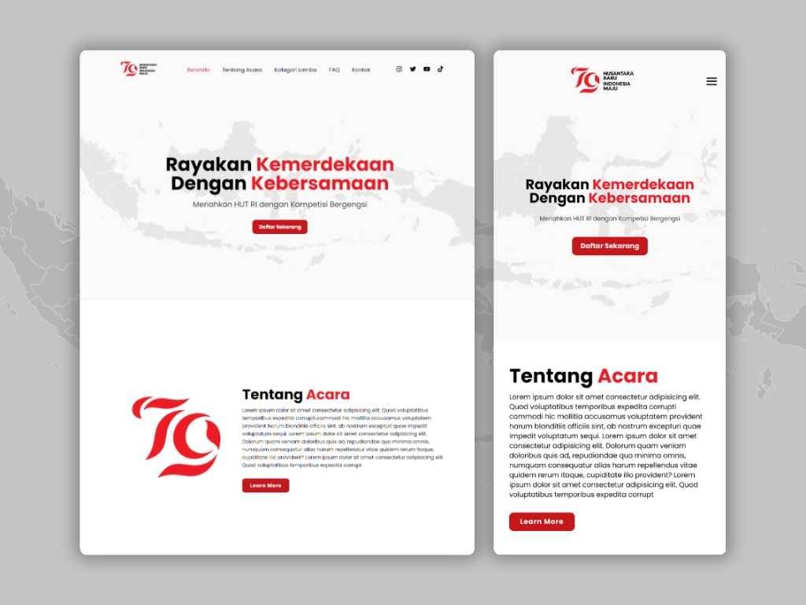

# 79th Indonesian Independence Day Landing Page

Responsive Landing Page Website to Celebrate the 79th Indonesian Independence Day. This project highlights the spirit of unity and showcases various events and competition.

<a href="https://indonesia-independence-day.vercel.app/"><strong> ➥ Live Demo</strong></a>



## About The Project

The Landing Page is designed to celebrate the 79th Indonesian Independence Day, featuring details about events, competitions, and ways to participate.

### Logo
This project uses the official logo released by the Ministry of State Secretariat of the Republic of Indonesia (Kemensetneg RI). The theme "Nusantara Baru Indonesia Maju" signifies that the 79th Independence Day is a significant milestone for Indonesia, marking three major transitions: welcoming the new capital city, a change in leadership, and the vision of Indonesia Emas 2045.


### Built With

- HTML
- CSS
- JavaScript
- Swiper.js


## Features

- **Responsive Design:** Optimized for both desktop and mobile views.
- **Interactive Elements:** Includes a button and a pop-up form for registration, and information sections about the event.
- **Visual Appeal:** Uses a color scheme and design that resonate with the spirit of Independence Day.
- **Swiper.js Carousel:** For showcasing a list of competitions and event highlights.


## Getting Started

To get a local copy up and running, follow these simple steps.

### Prerequisites

Before you begin, ensure you have met the following requirements:

* [Git](https://git-scm.com/downloads "Download Git") must be installed on your operating system.

Clone the repo

```bash
git clone https://github.com/Slmmaula/indonesia-independence-day.git
```

Go to the project directory
```bash
cd indonesia-independence-day
```

Install dependencies

```bash
  npm install
```

Start the server

```bash
  npm run start
```

Open your browser and access the application at http://localhost:3000 (or the port used by the application).

## Contributing

Contributions are always welcome!
Any contributions you make are greatly appreciated.

See `/contributing.md` for ways to get started.

## Contact

If you want to contact with me you can reach me at [Instagram](https://www.instagram.com/slmmaula_) - [Email](contact.slmmaula@gmail.com).

## Support

<a href="https://saweria.co/slmmaula" target="_blank"></a>

## License

Distributed under the [MIT](/LICENSE.txt) License.
